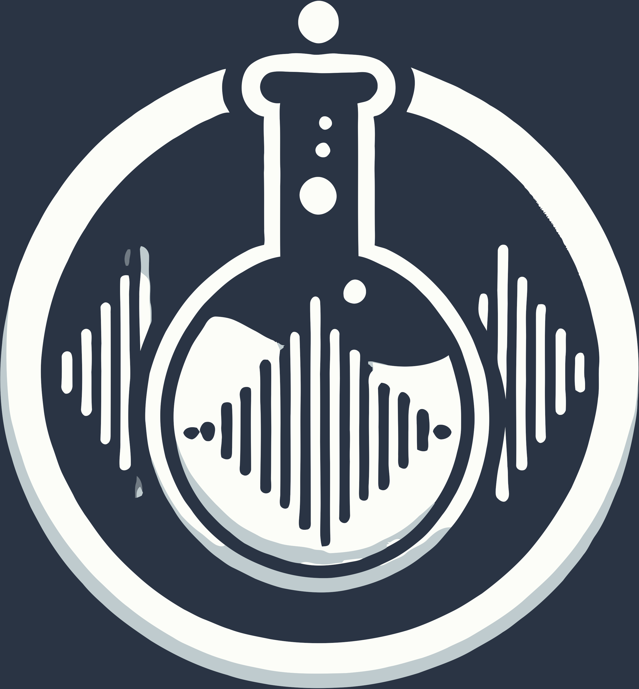
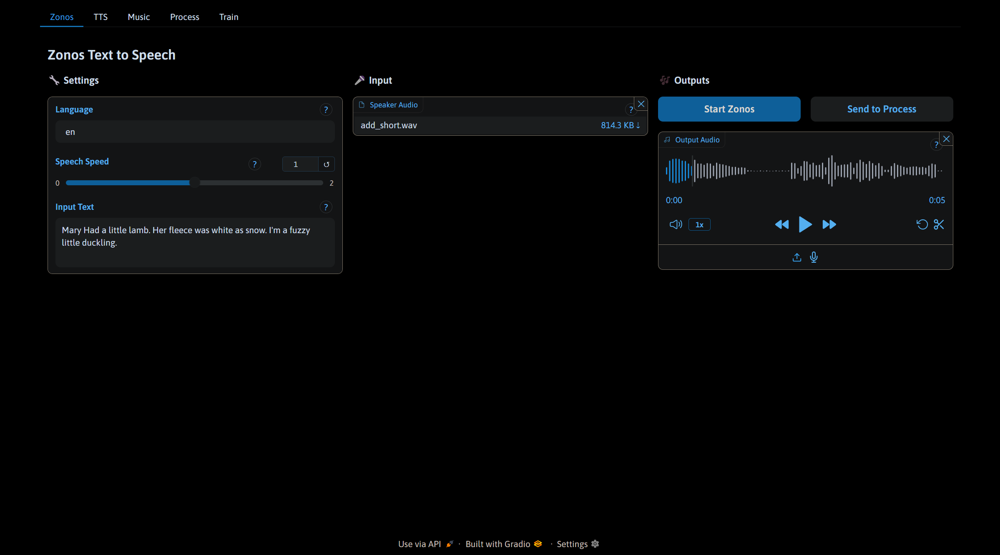
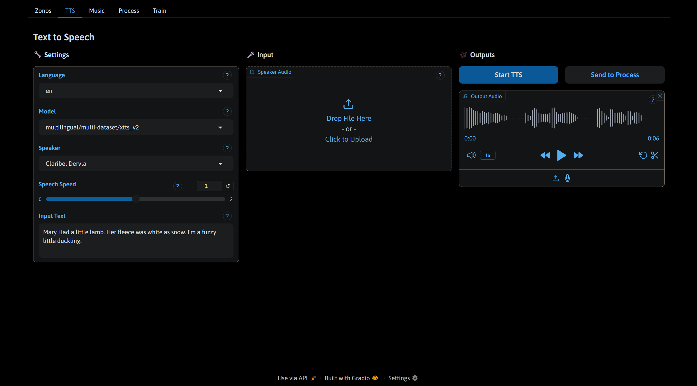
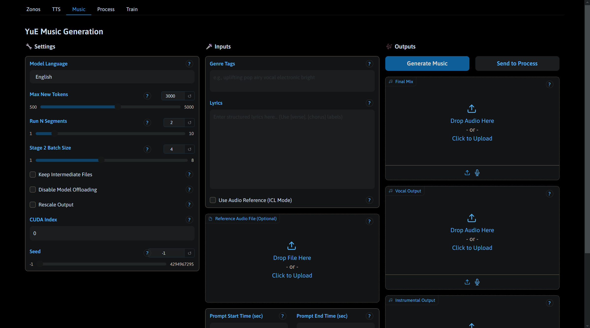
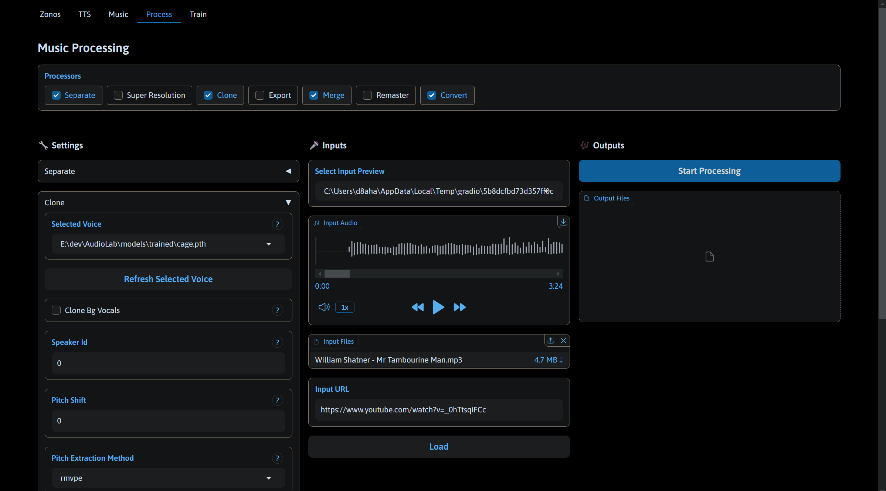
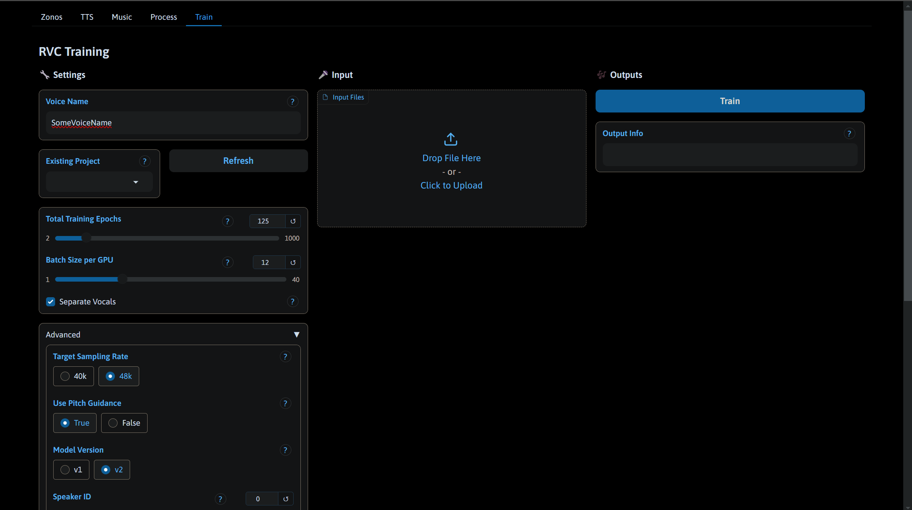

# AudioLab



[](LICENSE)
[](https://www.python.org/downloads/)
[](https://developer.nvidia.com/cuda-downloads)
[](CONTRIBUTING.md)

> **Huge thanks to RunDiffusion for supporting this project!** 🎉

AudioLab is an open-source powerhouse for voice-cloning and audio separation, built with modularity and extensibility in mind. Whether you're an audio engineer, researcher, or just a curious tinkerer, AudioLab has you covered.

---

## 🌟 Features

### 🎵 Audio Processing Capabilities
- **🎼 Music Generation:** Create music from scratch or remix existing tracks using YuE.
- **🗣️ Zonos Text-to-Speech:** High-quality TTS with deep learning.
- **📢 Text-to-Speech:** Clone voices and generate natural-sounding speech with Coqui TTS.
- **🎛️ Audio Separation:** Isolate vocals, drums, bass, and other components from a track.
- **🎤 Vocal Isolation:** Distinguish lead vocals from background.
- **🔇 Noise Removal:** Get rid of echo, crowd noise, and unwanted sounds.
- **🧬 Voice Cloning:** Train high-quality voice models with just 30-60 minutes of data.
- **🚀 Audio Super Resolution:** Enhance and clean up audio.
- **🎚️ Remastering:** Apply spectral characteristics from a reference track.
- **🔄 Audio Conversion:** Convert between popular formats effortlessly.

### 🤖 Automation Features
- **Auto-preprocessing** for voice model training.
- **Merge separated sources** back into a single file with ease.

---

## 🛠️ Pre-requisites

Before you dive in, make sure you have:

1. **Python 3.10** – *Because match statements exist, and fairseq is allergic to 3.11.*
2. **CUDA 12.4** – *Other versions? Maybe fine. Maybe not. Do you like surprises?*
3. **Virtual Environment** – *Strongly recommended to avoid dependency chaos.*
4. **Windows Users** – *You’re in for an adventure! Zonos/Triton can be a pain. Make sure to install MSVC and add these paths to your environment variables:*
   ```plaintext
   C:\Program Files (x86)\Microsoft Visual Studio\2022\BuildTools\VC\Tools\MSVC\14.42.34433\bin\Hostx64\x64
   C:\Program Files (x86)\Microsoft Visual Studio\2022\BuildTools\VC\Tools\MSVC\14.42.34433\bin\Hostx86\x86
   ```

> **Note:** This project assumes basic Python knowledge. If you’ve never set up a virtual environment before... now’s the time to learn! 🚀

---

## 🚑 Windows Troubleshooting

If dependencies refuse to install on Windows, try the following:

- Install **MSVC Build Tools**:
  - [VC Redist x64](https://aka.ms/vs/17/release/vc_redist.x64.exe)
  - [Build Tools](https://aka.ms/vs/17/release/vs_BuildTools.exe)
- Ensure **CUDA is correctly installed**:
  - Check version: `nvcc --version`
  - [Download CUDA 12.4](https://developer.download.nvidia.com/compute/cuda/12.4.0/local_installers/cuda_12.4.0_551.61_windows.exe)
- DLL Errors? Try moving necessary DLLs from `/libs` to:
  ```plaintext
  .venv\lib\site-packages\pandas\_libs\window
  .venv\lib\site-packages\sklearn\.libs
  C:\Program Files\Python310\ (or wherever your Python is installed)
  ```

---

## 🚀 Installation

> **Heads up!** The `requirements.txt` is *not* complete on purpose. Use the setup scripts instead!

### 🛠 Steps

1. Clone the repository:
   ```bash
   git clone https://github.com/yourusername/audiolab.git
   cd audiolab
   ```
2. Set up a virtual environment:
   ```bash
   python -m venv venv
   source venv/bin/activate  # Windows: venv\Scripts\activate
   ```
3. Run the setup script:
   ```bash
   ./setup.sh  # Windows: setup.bat
   ```

**Common Issues & Fixes:**
- Downgrade `pip` if installation fails:
  ```bash
  python -m pip install pip==24.0
  ```
- Install older CUDA drivers if needed: [CUDA Toolkit Archive](https://developer.nvidia.com/cuda-toolkit-archive)
- Install `fairseq` manually if necessary:
  ```bash
  pip install fairseq>=0.12.2 --no-deps
  ```

---

## 🎛️ Running AudioLab

1. Activate your virtual environment:
   ```bash
   source venv/bin/activate  # Windows: venv\Scripts\activate.bat
   ```
2. Run the application:
   ```bash
   python main.py
   ```
3. Optional flags:
   - `--listen` → Bind to `0.0.0.0` for remote access.
   - `--port PORT` → Specify a custom port.

---

## 📸 Screenshots

|  |  |
|---------------------------------|---------------------------------|
|  |  |
|  | |

---

## 🤝 Acknowledgements

AudioLab is powered by some fantastic open-source projects:
- 🎵 [python-audio-separator](https://github.com/nomadkaraoke/python-audio-separator) – Core for audio separation.
- 🎚 [matchering](https://github.com/sergree/matchering) – Professional-grade remastering.
- 🔊 [versatile-audio-super-resolution](https://github.com/haoheliu/versatile_audio_super_resolution) – High-quality audio enhancement.
- 🎙 [Real-Time-Voice-Cloning](https://github.com/RVC-Project/Retrieval-based-Voice-Conversion-WebUI) – Voice cloning.
- 🎶 [MVSEP-MDX23](https://github.com/ZFTurbo/MVSEP-MDX23-music-separation-model) – Music separation.
- 📜 [WhisperX](https://github.com/m-bain/whisperX) – Audio transcription.
- 🗣 [Coqui TTS](https://github.com/coqui-ai/TTS) – State-of-the-art TTS.
- 🎼 [YuE](https://github.com/multimodal-art-projection/YuE) – Music generation.
- 🏆 [Zonos](https://github.com/Zyphra/Zonos) – High-quality TTS.

---

## 🌟 Contribute

Want to help? Check out the [Contributing Guide](CONTRIBUTING.md)! 

---

## 📜 License

Licensed under MIT. See [LICENSE](LICENSE) for details.

---

Made with ❤️ by the AudioLab team. (AKA D8ahazard)
