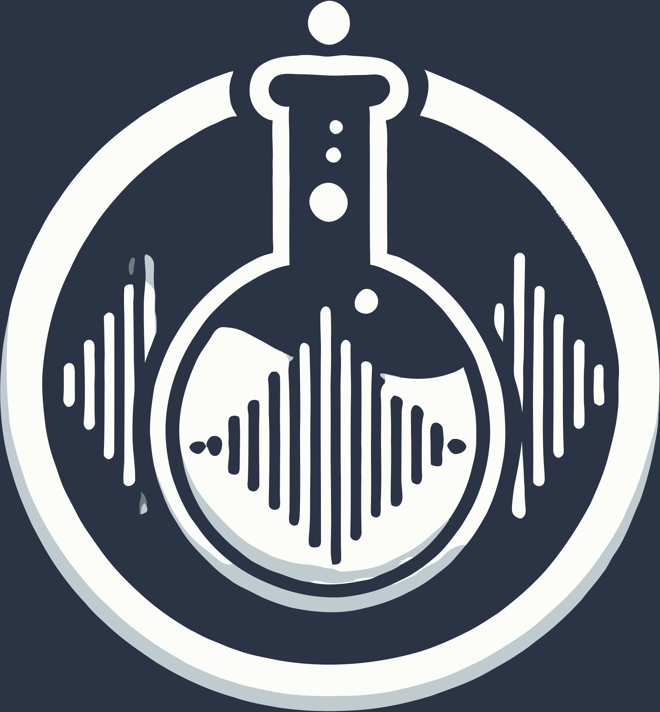
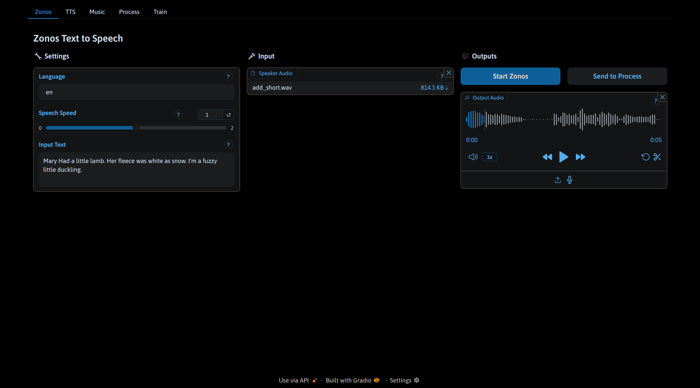
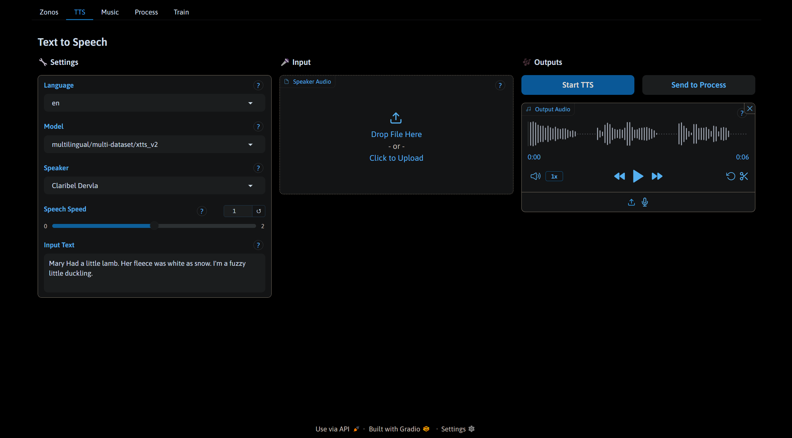
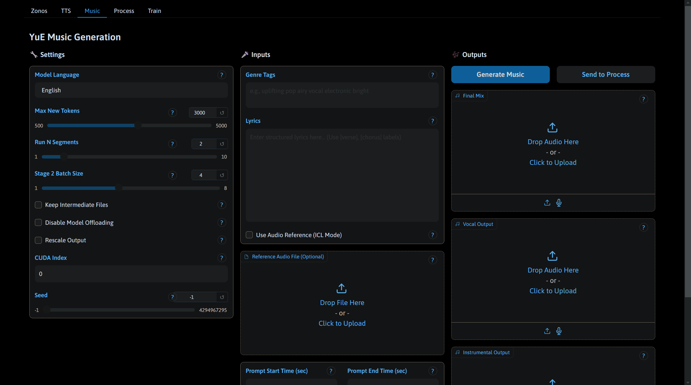
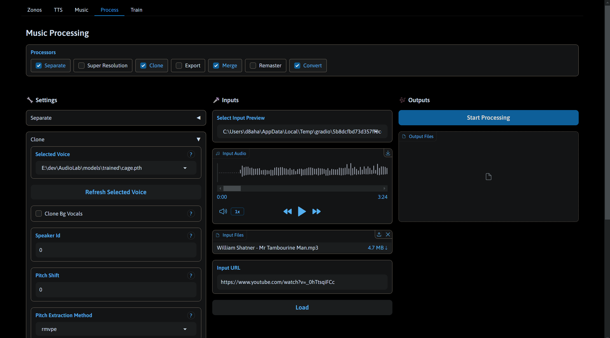

# AudioLab

<p align="center">
  
</p>

<p align="center">
  <a href="LICENSE"></a>
  <a href="https://www.python.org/downloads/"></a>
  <a href="https://developer.nvidia.com/cuda-downloads"></a>
  <a href="CONTRIBUTING.md"></a>
</p>

<p align="center">
  <strong>Open-source audio processing suite for voice cloning, separation, TTS, and music generation</strong>
</p>

---

## Overview

AudioLab is a comprehensive audio processing application that combines state-of-the-art AI models for:

- **Audio Separation** — Isolate vocals, instruments, drums, and more from any audio track
- **Voice Cloning** — Train custom voice models with RVC for high-quality voice conversion
- **Text-to-Speech** — Generate natural speech with multiple TTS engines (Zonos, DIA, Chatterbox, Coqui)
- **Music Generation** — Create original music with YuE, ACE-Step, and Stable Audio
- **Audio Enhancement** — Super-resolution, remastering, noise removal, and format conversion

Built with a modular architecture, AudioLab provides both a web-based UI (Gradio) and a comprehensive REST API (FastAPI).

## Key Features

| Feature | Description |
|---------|-------------|
| **Multi-Model Separation** | Ensemble-based separation using BS-RoFormer, Mel-Band Roformer, and MDX23C for maximum quality |
| **RVC Voice Cloning** | Train custom voice models with 30-60 minutes of audio data |
| **Advanced TTS** | Multiple engines: Zonos (emotional), DIA (dialogue), Chatterbox, Coqui XTTS |
| **Music Generation** | Full-length song generation with lyrics support via YuE and ACE-Step |
| **DAW Export** | Export stems directly to Ableton Live and Reaper project formats |
| **REST API** | Complete programmatic access to all features |

## Screenshots

| Zonos TTS | Coqui TTS |
|-----------|-----------|
|  |  |

| YuE Music | Process Tab |
|-----------|-------------|
|  |  |

---

## Requirements

### System Requirements

- **Python**: 3.10, 3.11, or 3.12 (3.10 recommended for best compatibility)
- **CUDA**: 12.4 (for GPU acceleration)
- **RAM**: 16 GB minimum, 32 GB recommended
- **VRAM**: 8 GB minimum for GPU inference, 12+ GB for training
- **Storage**: 20 GB for models and dependencies

### Windows Prerequisites

For Windows users, install the following before proceeding:

1. **Visual C++ Build Tools** — Required for compiling certain dependencies
   - [Download VC Redist x64](https://aka.ms/vs/17/release/vc_redist.x64.exe)
   - [Download Build Tools](https://aka.ms/vs/17/release/vs_BuildTools.exe)

2. **CUDA Toolkit 12.4**
   - [Download CUDA 12.4](https://developer.download.nvidia.com/compute/cuda/12.4.0/local_installers/cuda_12.4.0_551.61_windows.exe)
   - Verify installation: `nvcc --version`

3. **Add MSVC paths to environment** (for Triton/Zonos):
   ```
   C:\Program Files (x86)\Microsoft Visual Studio\2022\BuildTools\VC\Tools\MSVC\<version>\bin\Hostx64\x64
   ```

---

## Installation

### Quick Start (Recommended)

```bash
# Clone the repository
git clone https://github.com/d8ahazard/AudioLab.git
cd AudioLab

# Create and activate virtual environment
python -m venv venv
source venv/bin/activate  # Linux/macOS
# or
.\venv\Scripts\activate   # Windows

# Run the unified installer
python install.py
```

The installer automatically detects your system configuration (OS, GPU, CUDA version) and installs the appropriate dependencies.

### Installation Options

```bash
python install.py --cpu        # CPU-only installation (no CUDA required)
python install.py --dev        # Include development tools
python install.py --minimal    # Core dependencies only
python install.py --help       # Show all options
```

### Docker Installation

For containerized deployment:

```bash
# GPU-enabled
docker-compose up -d

# CPU-only
docker-compose --profile cpu up -d

# Development mode (with live code reload)
docker-compose --profile dev up -d
```

### Manual Installation

If you prefer manual installation:

```bash
# Install PyTorch with CUDA
pip install torch==2.6.0 torchvision==0.21.0 torchaudio==2.6.0 \
    --index-url https://download.pytorch.org/whl/cu124

# Install custom wheels
pip install -r requirements-wheels.txt

# Install core dependencies
pip install -r requirements-core.txt

# Install CUDA-specific packages (optional)
pip install -r requirements-cuda.txt
```

---

## Usage

### Starting the Application

```bash
# Activate virtual environment
source venv/bin/activate  # Linux/macOS
.\venv\Scripts\activate   # Windows

# Start AudioLab
python main.py

# With options
python main.py --listen          # Bind to 0.0.0.0 for network access
python main.py --port 8080       # Custom port
python main.py --api-only        # API server only (no UI)
```

Access the web interface at: `http://127.0.0.1:7860`

### API Documentation

When running, API documentation is available at:
- Swagger UI: `http://127.0.0.1:7860/api/docs`
- ReDoc: `http://127.0.0.1:7860/api/redoc`

---

## Processing Pipeline

AudioLab uses a modular wrapper system for audio processing:

```
Input → [Separate] → [Clone] → [Remaster] → [Super-Res] → [Merge] → [Export] → Output
```

Each processor can be enabled/disabled independently. The system automatically handles:
- Multi-file batch processing
- Progress tracking with ETA
- Intermediate result caching
- Error recovery

### Available Processors

| Processor | Description |
|-----------|-------------|
| **Separate** | AI-powered stem separation (vocals, instruments, drums) |
| **Clone** | Voice conversion using trained RVC models |
| **Remaster** | Apply spectral characteristics from reference tracks |
| **Super Resolution** | Enhance audio quality and clarity |
| **Merge** | Combine stems with custom mixing |
| **Convert** | Format conversion (WAV, MP3, FLAC, etc.) |
| **Export** | DAW project export (Ableton, Reaper) |
| **Compare** | A/B comparison of original and processed audio |

---

## Audio Separation

AudioLab uses an ensemble of state-of-the-art models for maximum separation quality:

### Separation Profiles

| Profile | Models | Quality | Speed |
|---------|--------|---------|-------|
| **V1 (Standard)** | 2 models | Good | Fast |
| **V2 (High Quality)** | 3 models | Excellent | Moderate |

### Supported Stems

- Main Vocals / Background Vocals
- Instrumental (full)
- Drums (with sub-components: kick, snare, hi-hat, cymbals)
- Bass
- Guitar
- Piano/Keys
- Woodwinds
- Other instruments

### Post-Processing

- Reverb removal
- Echo/delay removal
- Noise reduction
- Crowd noise removal

---

## Voice Cloning (RVC)

Train custom voice models for high-quality voice conversion:

### Training Requirements

- **Audio Data**: 30-60 minutes of clean speech
- **Format**: WAV preferred, 44.1kHz stereo
- **Quality**: Clear recordings without background noise

### Quick Training

1. Navigate to the **Train RVC** tab
2. Upload training audio files
3. Configure training parameters (or use defaults)
4. Click "Start Training"
5. Model will be saved to `models/trained/`

### Inference

1. Go to the **Process** tab
2. Enable "Separate" and "Clone" processors
3. Select your trained voice model
4. Process your audio

---

## Text-to-Speech

Multiple TTS engines are available:

| Engine | Strengths | Voice Cloning |
|--------|-----------|---------------|
| **Zonos** | Emotional expression, high quality | Yes (reference audio) |
| **DIA** | Realistic dialogue, multiple speakers | Yes (with transcript) |
| **Chatterbox** | Natural prosody | Yes (reference audio) |
| **Coqui XTTS** | Multilingual support | Yes (voice samples) |

### Usage

1. Navigate to the **TTS** tab
2. Select your preferred engine
3. Enter text and configure options
4. Upload reference audio for voice cloning (optional)
5. Generate speech

---

## Music Generation

Generate original music with AI:

### Available Models

| Model | Capabilities |
|-------|-------------|
| **YuE** | Full song generation with lyrics, multiple genres |
| **ACE-Step** | Fast high-quality generation with LoRA customization |
| **Stable Audio** | Sound effects and ambient audio from text prompts |

### Usage

1. Navigate to the **Music** tab
2. Select your model
3. Enter prompts/lyrics
4. Configure generation parameters
5. Generate and preview

---

## Troubleshooting

### Common Issues

<details>
<summary><strong>CUDA not detected</strong></summary>

1. Verify CUDA installation: `nvcc --version`
2. Check PyTorch CUDA: `python -c "import torch; print(torch.cuda.is_available())"`
3. Reinstall PyTorch with CUDA: `pip install torch --index-url https://download.pytorch.org/whl/cu124`
</details>

<details>
<summary><strong>Out of memory errors</strong></summary>

1. Reduce batch size in settings
2. Use V1 separation profile instead of V2
3. Process shorter audio segments
4. Close other GPU applications
</details>

<details>
<summary><strong>DLL errors on Windows</strong></summary>

Copy required DLLs from `/libs` to:
- `.venv/lib/site-packages/pandas/_libs/window`
- `.venv/lib/site-packages/sklearn/.libs`
- Your Python installation directory
</details>

<details>
<summary><strong>espeak-ng not found</strong></summary>

- **Windows**: Download and install from [espeak-ng releases](https://github.com/espeak-ng/espeak-ng/releases)
- **Linux**: `sudo apt install espeak-ng`
- **macOS**: `brew install espeak-ng`
</details>

---

## Project Structure

```
AudioLab/
├── handlers/          # Core handler modules (config, downloads, etc.)
├── layouts/           # Gradio UI layouts for each tab
├── modules/           # AI model implementations
│   ├── acestep/       # ACE-Step music generation
│   ├── cloning/       # Voice cloning utilities
│   ├── rvc/           # RVC voice conversion
│   ├── separator/     # Audio separation
│   ├── stable_audio/  # Stable Audio generation
│   ├── yue/           # YuE music generation
│   └── zonos/         # Zonos TTS
├── util/              # Shared utilities
├── wrappers/          # Processing pipeline wrappers
├── main.py            # Application entry point
├── api.py             # FastAPI configuration
└── install.py         # Unified installer
```

---

## Contributing

Contributions are welcome! Please see [CONTRIBUTING.md](CONTRIBUTING.md) for guidelines.

### Development Setup

```bash
# Install with development dependencies
python install.py --dev

# Run tests
pytest

# Format code
ruff format .
ruff check --fix .
```

---

## Acknowledgements

AudioLab builds upon these excellent open-source projects:

- [audio-separator](https://github.com/nomadkaraoke/python-audio-separator) — Core separation library
- [RVC](https://github.com/RVC-Project/Retrieval-based-Voice-Conversion-WebUI) — Voice cloning
- [Coqui TTS](https://github.com/coqui-ai/TTS) — Text-to-speech
- [Zonos](https://github.com/Zyphra/Zonos) — Emotional TTS
- [YuE](https://github.com/multimodal-art-projection/YuE) — Music generation
- [Stable Audio](https://github.com/Stability-AI/stable-audio-tools) — Audio generation
- [WhisperX](https://github.com/m-bain/whisperX) — Transcription
- [matchering](https://github.com/sergree/matchering) — Audio remastering

Special thanks to **RunDiffusion** for supporting this project.

---

## License

AudioLab is released under the [MIT License](LICENSE).

---

<p align="center">
  Made with care by <a href="https://github.com/d8ahazard">D8ahazard</a>
</p>
